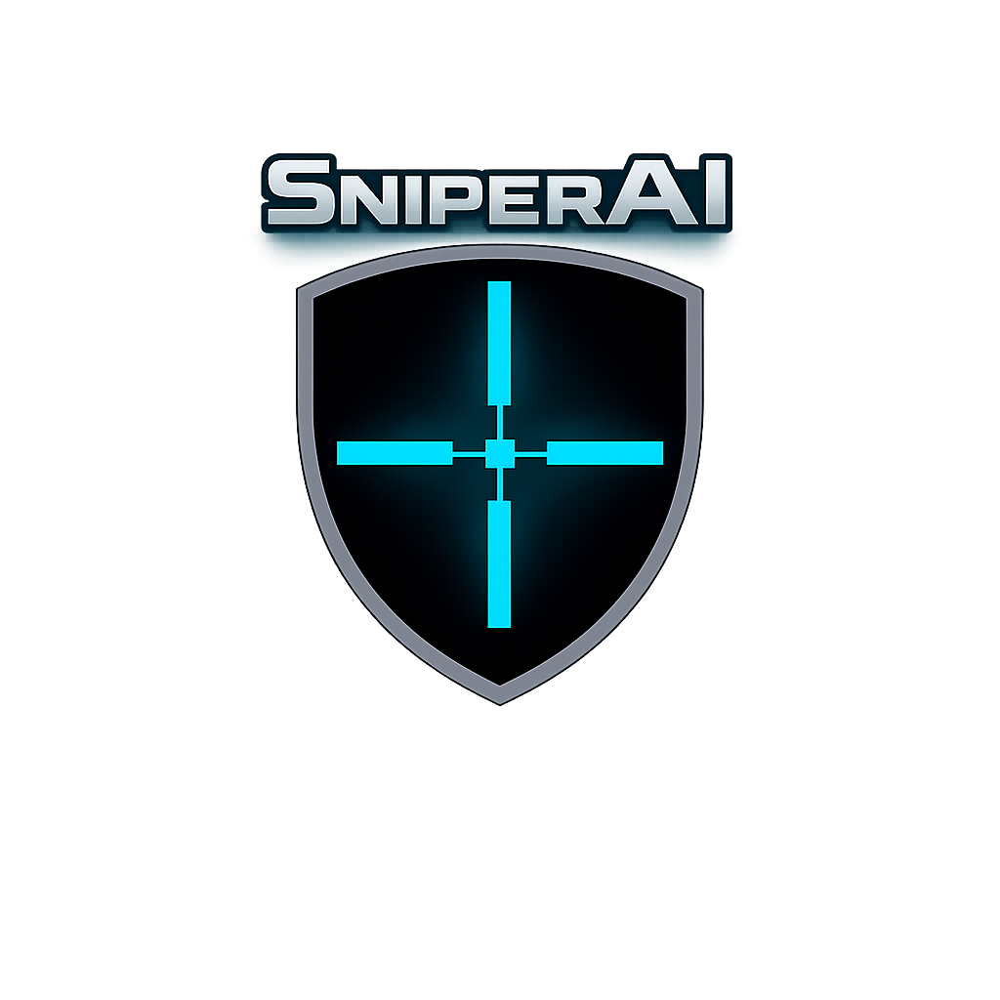
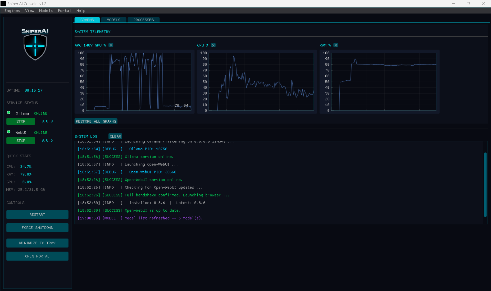

# Sniper AI Console

<p align="center">
  
</p>

**Enhanced cyberpunk control panel for managing a local AI stack powered by [Ollama](https://ollama.com) + [Open-WebUI](https://github.com/open-webui/open-webui).**

Built with [DearPyGui](https://github.com/hoffstadt/DearPyGui) for a fast, native desktop experience.

---

## Features

- **Service Control** - Individual START/STOP toggles for Ollama and Open-WebUI with real-time status indicators
- **System Telemetry** - Live GPU, CPU, and RAM graphs updated every second
- **Model Manager** - Pull, list, and delete Ollama models directly from the console
- **Process Monitor** - Top 25 processes by CPU usage with AI stack highlighting
- **Update Manager** - Check for and install Open-WebUI updates from the Help menu
- **Health Check** - Detects crashed/zombie processes and reports status automatically
- **File Logging** - Rotating log file (`sniper_ai.log`) for post-mortem debugging
- **System Tray** - Minimize to tray with right-click restore/exit
- **Cyberpunk Theme** - Dark UI with cyan/green/red colour-coded elements

## Screenshots

<p align="center">
  
</p>

## Requirements

- **OS**: Windows 10/11
- **Python**: 3.10+
- **Ollama**: Installed locally
- **Open-WebUI**: Installed in a Python virtual environment

### Python Dependencies

```
pip install dearpygui psutil requests pillow pystray
```

> `requests`, `pillow`, and `pystray` are optional - the console degrades gracefully without them.

## Installation

1. Clone the repository:
```bash
git clone https://github.com/leonuz/sniper-ai-console.git
cd sniper-ai-console
```

2. Install dependencies:
```bash
pip install dearpygui psutil requests pillow pystray
```

3. Edit `config.json` to match your local paths:
```json
{
    "paths": {
        "ollama": "C:\\path\\to\\ollama.exe",
        "webui": "C:\\path\\to\\open-webui\\venv\\Scripts\\open-webui.exe"
    }
}
```

4. Copy your `icon.ico` and `logo.png` to the project folder.

5. Run:
```bash
python main.py
```

Or double-click `start.bat`.

## Configuration

All settings live in `config.json` - no need to edit code. The file is auto-generated with defaults if missing.

| Section | What it controls |
|---------|-----------------|
| `app` | Name, version, author info |
| `paths` | Ollama and WebUI executable locations |
| `urls` | Portal URL, API endpoints |
| `files` | Icon and logo filenames |
| `ui` | Window dimensions, graph sizes, refresh intervals |
| `engines` | Ports, host bindings, browser command |
| `logging` | Log file path, rotation size, backup count |
| `gpu` | GPU label and monitoring method |

## Project Structure

```
sniper-ai-console/
├── main.py           # Entry point + update loop
├── config.py         # Configuration loader
├── state.py          # Shared mutable state
├── logger.py         # Visual log + rotating file log
├── helpers.py        # Utilities (ports, process kill, GPU)
├── engines.py        # Service start/stop/toggle
├── monitoring.py     # Telemetry, models, process table
├── updater.py        # Open-WebUI update checker/installer
├── ui.py             # GUI theme, layout, help popups
├── config.json       # User-editable configuration
├── CHANGELOG.md      # Version history
├── MANUAL.md         # User manual
├── start.bat         # Windows launcher
├── icon.ico          # Window/tray icon
└── logo.png          # Splash + sidebar logo
```

## License

MIT License - see [LICENSE](LICENSE) for details.

## Author

**Leonuz** - [GitHub](https://github.com/leonuz)
